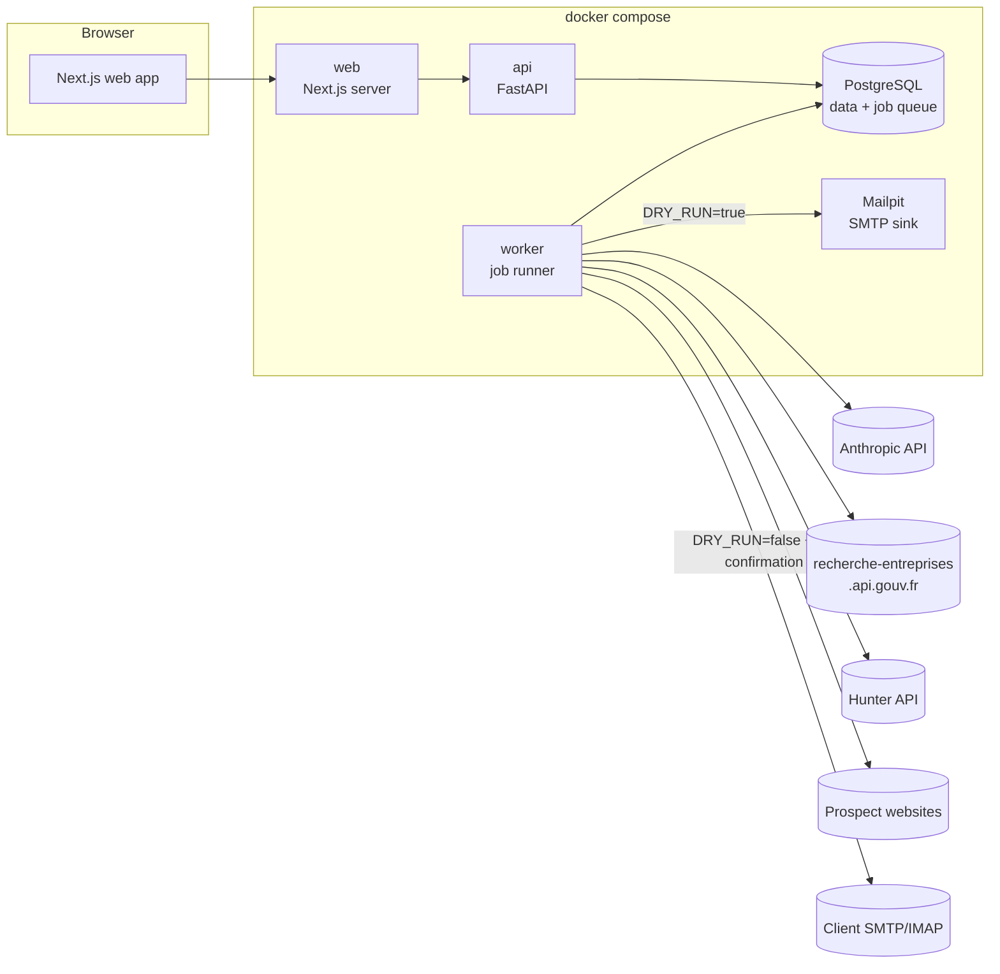
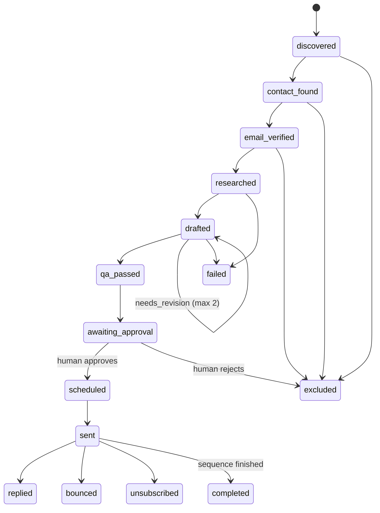

# Implementation plan — `outreach-agents`

> Status: **v2 (2026-09-30), validated by the developer.** Answers to the open questions are
> recorded in [Validated decisions](#validated-decisions-2026-09-30).
>
> Source of truth for requirements: [`docs/PROJECT_BRIEF.fr.md`](PROJECT_BRIEF.fr.md) (French).

## Progress

| Phase | Scope | Status |
|---|---|---|
| 0 | Foundations & security | Done — validated 2026-09-30 |
| 1 | Data model, `LLMClient`, `fetch_page`, Agents 1–2, screens 1–2 | Done — awaiting validation (PR from `phase-1`) |
| 2 | Discovery: Agents 3–4, job queue + worker, screen 3 | Not started |
| 3 | Personalisation & writing: Agents 5–7, prompt-injection tests, first evals | Not started |
| 4 | Sending & compliance: approval queue, SMTP, footer, RFC 8058, suppression, caps, DNS check | Not started |
| 5 | Replies: IMAP, threading, Agent 8, screen 5 | Not started |
| 6 | Steering: Agent 9, metrics, circuit breakers, retention, erasure | Not started |
| 7 | Portfolio: full demo mode, READMEs, GIF, `v0.1.0` | Not started |

---

## 1. Architecture

- **api** serves the REST API (OpenAPI schema → typed TypeScript client). It never calls slow
  external services inside a request: it enqueues jobs.
- **worker** pulls jobs from PostgreSQL (`SELECT … FOR UPDATE SKIP LOCKED`), runs the
  orchestrator step for one prospect/campaign, and commits the state transition. Every job is
  idempotent (idempotency key + state check before acting) and retryable.
- **Orchestrator = deterministic state machine** (ADR 0001). Each step calls exactly one
  specialised agent with typed input, a minimal tool set and a Pydantic-validated output.
- **LLM layer**: `LLMClient` protocol with `AnthropicClient` (official `anthropic` SDK, tool use,
  JSON validated by Pydantic, one retry with the validation error) and `FakeLLM`
  (deterministic, recorded responses) for tests and demo mode. Every call is logged to
  `llm_calls` (agent, model, tokens, estimated cost, duration, success) without content.
- **Safety boundaries**: agents that read external content (web pages, inbound emails) never get
  action tools (send, delete). External content is wrapped in `<untrusted_web_content>` /
  `<untrusted_email>` tags and treated as data.

### Prospect state machine

`failed` and `excluded` always carry a reason. Every transition is written to
`prospect_transitions` (from, to, reason, actor, timestamp). Suppression is checked at
**every** transition that leads toward sending, not only at send time.

---

## 2. Data model (PostgreSQL, SQLAlchemy 2, Alembic)

Conventions: UUID primary keys, `created_at`/`updated_at` (UTC, `timestamptz`), every business
table has `workspace_id` (FK, indexed). Enumerations are PostgreSQL `text` + `CHECK` constraints
(easier to migrate than native enums).

| Table | Key columns | Notes |
|---|---|---|
| `workspaces` | name, legal_sender_name, legal_company_name, legal_address, privacy_contact_email, booking_url, target_country (`FR`), retention_days, daily_llm_budget_eur, global_pause | One row in the self-hosted MVP; multi-tenant ready. |
| `users` | workspace_id, email, password_hash, role | Single admin in MVP (see Q2). |
| `offer_profiles` | source_url, source_description, data (JSONB, validated `OfferProfile`), status (`draft`/`validated`), version | Each claim in `data` carries its source URL. |
| `segments` | offer_profile_id, name, description, criteria (JSONB: NAF codes, headcount ranges, départements, keywords), target_titles, main_pain, hook_angle, fit_score (0–100), fit_rationale, selected | |
| `campaigns` | offer_profile_id, name, target_country, status, tone, language, followup_delays_days | |
| `campaign_segments` | campaign_id, segment_id | Many-to-many. |
| `companies` | siren, name, naf_code, headcount_range, postal_code, departement, website_domain, domain_status (`confirmed`/`unconfirmed`/`not_found`), domain_evidence_url, source_provider | Unique `(workspace_id, siren)` and partial unique `(workspace_id, website_domain)`. |
| `contacts` | company_id, first_name, last_name, title, email, email_hash, is_generic, verification_status (`valid`/`accept_all`/`unknown`/`invalid`/`webmail`/`disposable`/`unverified`), verified_at, source_provider | Only `valid` is sendable by default. |
| `prospects` | campaign_id, segment_id, company_id, contact_id, state, state_reason, sending_account_id (sticky), next_action_at | **Added to the brief's list**: the state machine needs one row per (campaign, company). |
| `prospect_transitions` | prospect_id, from_state, to_state, reason, actor | Audit of the state machine. |
| `facts` | company_id, contact_id (nullable), claim, excerpt, source_url, collected_at, relevance_score, content_hash | `excerpt` must be an exact substring of the fetched page text (checked in code). |
| `sequences` | prospect_id, status | Initial email + up to 2 follow-ups. |
| `messages` | sequence_id, prospect_id, direction (`outbound`/`inbound`), step, subject, body_text, status, scheduled_at, sent_at, message_id_header, in_reply_to, references, sending_account_id, qa_verdict, qa_reasons, classification, classification_confidence | |
| `message_facts` | message_id, fact_id | Join table instead of an array: referential integrity. |
| `approvals` | message_id, decision (`approved`/`edited`/`rejected`), decided_by, comment | |
| `suppression_list` | email_hash (SHA-256 of normalised address), reason (`unsubscribe`/`refusal`/`hard_bounce`/`erasure`/`manual`), source | Unique `(workspace_id, email_hash)`. Never deleted. |
| `sending_accounts` | from_name, from_email, smtp_host/port/username, smtp_password_enc, imap_host/port/username, imap_password_enc, dkim_selector, daily_cap, warmup_start_date, status | Credentials encrypted with Fernet (`FERNET_KEY` in `.env`). |
| `jobs` | kind, payload, status, attempts, max_attempts, run_after, locked_at, locked_by, last_error, idempotency_key | Unique idempotency key; `SKIP LOCKED` polling. |
| `llm_calls` | agent, model, prompt_version, input_tokens, output_tokens, cost_eur_estimate, duration_ms, success, error_type | No prompt or completion content. |
| `provider_calls` | provider, operation, request_hash, status_code, response (JSONB), credits_used, expires_at | Doubles as the provider cache. |
| `recommendations` | campaign_id, segment_id, kind, rationale, metrics_snapshot, status | **Added**: Agent 9 output, never auto-applied. |
| `audit_log` | actor, action, entity_type, entity_id, details | Who approved / sent / deleted what, when. No secrets, no email bodies. |

Unsubscribe links use an HMAC-signed token (stdlib `hmac`, key in `.env`), so no extra table.

---

## 3. Technical choices (with reasons)

| Choice | Why | Alternatives considered |
|---|---|---|
| **uv workspace at repo root**, backend as member (`backend/pyproject.toml`) | One `.venv`, one lockfile, `uv run python -m evals.run` works from the root as the brief requires, VS Code finds the interpreter automatically. | Standalone backend project (evals would need `--project` flags). |
| **psycopg 3** as the only PostgreSQL driver | Supports async (app, worker) *and* sync (Alembic) with one dependency; binary wheels on Windows and macOS. | asyncpg + psycopg2 (two drivers). |
| **Python 3.12** | Minimum required by the brief, already installed, widest library compatibility. | 3.13/3.14 (possible later). |
| **PostgreSQL 18** (`postgres:18-alpine`) | Current stable major. Volume mounted at `/var/lib/postgresql` as required by the 18+ image ([Docker Hub](https://hub.docker.com/_/postgres)). | 17. |
| **npm** for the web app | Ships with Node on both machines: nothing extra to install for a beginner or a recruiter. | pnpm (faster, but one more tool). |
| **Next.js standalone build** in Docker; server components call the API through the compose network | `docker compose up` gives a production-like app; no CORS needed for server-side calls. | `next dev` in Docker (slow file watching on Windows). |
| **Dev loop**: `docker compose up db mailpit` + `uv run …`/`npm run dev` locally | Hot reload stays fast on Windows and macOS. | Everything in Docker with bind mounts. |
| **gitleaks pre-commit hook in Docker** (official image, pinned `v8.30.1`) | Identical on Windows and macOS; the upstream `golang` hook was blocked by Windows Smart App Control on the dev machine. | Upstream `gitleaks` hook, `gitleaks-system` (manual install). |
| **Other pre-commit hooks as local `python -m` hooks** | Same Smart App Control issue with generated `.exe` launchers. | Upstream hook repos. |
| **gitleaks in CI**: same pinned Docker image, full history on every push/PR | Same version and config as locally; `gitleaks-action` only scans pushed commits on `push` events. | `gitleaks/gitleaks-action@v3`. |
| **Commit author email = GitHub `noreply` address** (repo-local git config) | The global git config contains a real email address; the brief forbids real emails in commits. | — |
| **LF line endings everywhere** (`.gitattributes`) | Identical files on Windows and macOS; Linux containers. | — |
| **English for all repository docs** except `README.fr.md`; French in chat | Recruiters are the audience of the public repo. | French docs. |

LLM models (verified 2026-09-30 on
[platform.claude.com/docs/en/about-claude/models/overview](https://platform.claude.com/docs/en/about-claude/models/overview)):
`LLM_MODEL_REASONING=claude-sonnet-5-5`, `LLM_MODEL_FAST=claude-haiku-4-5` (alias of
`claude-haiku-4-5-20251001`). Both live in `.env`, never in code. See risk R4.

---

## 4. Challenges to the brief (please validate)

1. **The official company API returns no website.** `recherche-entreprises.api.gouv.fr/search`
   returns SIREN, NAF, address, headcount range and *dirigeants*, but no domain
   ([OpenAPI](https://recherche-entreprises.api.gouv.fr/openapi.json)). Since Google scraping is
   forbidden, the proposal is: candidate domain from Hunter (company name → domain) or from the
   user's CSV, then **confirmation by finding the SIREN on the site's legal notice page**
   (French law requires it on commercial sites). No SIREN match → `domain_status=unconfirmed`,
   never used for sending. Honest and verifiable.
2. **Rate limit of that API**: max 7 requests/second per IP, 429 + `Retry-After`, `per_page`
   max 25 (from its OpenAPI description). The provider will throttle at ≤ 5 req/s.
3. **Hunter Email Verifier also returns `webmail` and `disposable`**
   ([docs](https://hunter.io/api-documentation/v2)), not only the four statuses of the brief.
   Both will be stored and treated as non-sendable.
4. **A `prospects` table and a `recommendations` table** are added to the brief's list (see §2).
5. **`*.csv` is git-ignored except under `tests/fixtures/`.** Eval datasets will therefore be
   JSON/YAML, not CSV.
6. **One contact per company per campaign** in the MVP (the best-matching decision maker),
   to keep the state machine simple.

---

## 5. Risks

| # | Risk | Mitigation |
|---|---|---|
| R1 | Secret or personal data leaks into the public repo | `.gitignore` first, gitleaks pre-commit + CI (full history), Faker-only fixtures on `example.com`/`.test`, noreply commit email, review of `git diff --staged` before every commit. |
| R2 | LLM hallucinates facts about prospects | Facts must quote an exact excerpt from a stored page; emails cite fact IDs; QA agent checks every claim; hallucination-rate eval. |
| R3 | Prompt injection from websites or inbound emails | Untrusted-content tags, no action tools for reading agents, trapped-page tests. |
| R4 | Model lifecycle: `claude-haiku-4-5-20251001` is **Active**, tentative retirement "not sooner than October 15, 2026", with at least 60 days' notice before any retirement ([model deprecations](https://platform.claude.com/docs/en/about-claude/model-deprecations), checked 2026-09-30) | Model names in `.env` only; switching `LLM_MODEL_FAST` needs no code change. |
| R5 | Hunter free quota exhausted | `provider_calls` cache, credit counter checked before each call, FakeContactProvider in demo. |
| R6 | Deliverability (new domain, spam complaints) | Secondary sending domain, DNS checker, low daily caps with progressive ramp-up, bounce circuit breaker, no tracking pixel. |
| R7 | Legal misunderstanding (not a lawyer) | `docs/COMPLIANCE.md` with official CNIL links and a "not legal advice" notice; France only. |
| R8 | Windows/macOS drift | LF endings, no bash/Makefile, `uv`/`npm`/`docker compose` only, CI on Linux + documented commands for both OSes. |
| R9 | Scope is large for one beginner developer | Strict phase gates, small verifiable steps, demo mode first-class. |
| R10 | LLM cost overrun | Daily budget in euros checked before every call: warning at 80 %, LLM work paused at 100 % (see decision 7). Second safety net: a spend limit in the Anthropic Console. |

---

## 6. Task breakdown by phase

### Phase 0 — Foundations & security (validated 2026-09-30)
- [x] `git init`, repo-local noreply email, `.gitignore` before the first commit, `.gitattributes`, `.editorconfig`
- [x] `.env.example` with fake values only
- [x] pre-commit (gitleaks, forbid `.env`, private keys, large files, merge conflicts, case conflicts, YAML/TOML, end-of-file, trailing whitespace, LF endings, ruff lint + format)
- [x] `.gitleaks.toml` + automated test proving a fake secret is blocked + test of `.gitignore` rules
- [x] `CLAUDE.md` (< 80 lines)
- [x] Backend skeleton: FastAPI `/health` (DB ping + active mode), settings, email-masking logging, worker stub
- [x] Frontend skeleton: Next.js App Router + TypeScript + Tailwind + shadcn/ui, mode banner, API status
- [x] `docker-compose.yml`: `db`, `api`, `worker`, `web`, `mailpit` — one command: `docker compose up`
- [x] GitHub Actions CI: backend lint/type/test, web lint/type/build, pre-commit, gitleaks (full history), Docker build + smoke test — validated locally (actionlint + the same commands); first real run happens after the first push
- [x] Minimal README, `LICENSE` (MIT), `docs/SECURITY.md`, `docs/DECISIONS.md`, `docs/LEARNING_LOG.md`, ADR 0001, `docs/GITHUB_SETUP.md`

### Phase 1 — Data model, LLM layer, Agents 1–2 (done on branch `phase-1`, awaiting validation)
- [x] SQLAlchemy models + first Alembic migration (the Phase 1 tables of §2: workspaces, users,
      user sessions, offer profiles, segments, LLM calls, audit log; later phases add theirs);
      one-shot `migrate` service in docker compose; tests that migrations go up/down and match the models
- [x] Authentication (validated decision 2): single admin from `.env`, argon2, server-side sessions,
      HttpOnly + Secure + SameSite=Lax cookie, login lockout, demo account refused outside demo mode
- [x] `LLMClient` protocol, `AnthropicLLMClient` (structured outputs, strict tools, effort), `FakeLLM`
      (recorded demo answers), `llm_calls` journal with cost in euros, daily budget
      (80 % warning, 100 % pause, raise it from the UI) — validated decision 7
- [x] `fetch_page`: SSRF guard (DNS check + connected-peer check against DNS rebinding, every
      redirect re-checked), max 3 redirects, 2 MB cap, timeouts, HTML/text only, robots.txt
      (RFC 9309), honest User-Agent, one request per host per second; `trafilatura` extraction
- [x] Agent 1 (offer analyst, tools restricted to the client's site) + Agent 2 (ICP strategist,
      criteria validated against official NAF/headcount/département lists); versioned prompts;
      untrusted-content tags; evidence check in code removes claims not found in the fetched pages
- [x] Typed API client generated from OpenAPI (CI fails if it is stale); screens 1 (onboarding:
      analyse, review, edit, validate) and 2 (segments: score, rationale, criteria, selection)
- [x] Security: security headers, strict CSP with nonces (web), Origin check, API rate limiting,
      JSON errors with stable codes, licence check of every dependency (automated test)
- Deferred to Phase 2 (with the job queue): running agents in the worker instead of the HTTP request
- Deferred to Phase 4 (with sending accounts): Fernet encryption helpers and HMAC unsubscribe tokens

### Phase 2 — Discovery: Agents 3–4
- `CompanyProvider` interface: `RechercheEntreprisesProvider`, `CsvImportProvider`, `FakeProvider`
- Domain discovery + SIREN confirmation on legal notice page (challenge 1)
- `ContactProvider`: `HunterProvider` (cache, credit guard, 429/backoff), dirigeants from the gouv API, `FakeContactProvider`
- Webmail blocklist, generic-address flag, verification statuses, dedup by SIREN/domain
- PostgreSQL job queue + worker loop (idempotent, retries with exponential backoff, dead-letter)
- Screen 3 (campaign: prospect list, filters, detail)

### Phase 3 — Personalisation & writing: Agents 5–7
- Agent 5: facts with exact excerpt check, "nothing relevant found" path
- Agent 6: sequence writer (50–120 words, plain text, one CTA, cites fact IDs); legal footer added by code
- Agent 7: deterministic checks + LLM claim-support check, max 2 revision loops
- Prompt-injection test suite (trapped pages)
- `evals/`: 20–30 fictional cases, hallucination rate, compliance rate, first report

### Phase 4 — Sending & compliance
- Approval queue (screen 4): approve / edit / reject, one by one or in batch
- SMTP sending (`aiosmtplib`), DRY_RUN → Mailpit, explicit UI confirmation for live mode
- Legal footer, `List-Unsubscribe` + `List-Unsubscribe-Post: List-Unsubscribe=One-Click` (RFC 8058), public unsubscribe page, GDPR information page
- Suppression list enforced everywhere (100 % tested), daily caps, ramp-up, business-hours windows (Europe/Paris), random delays, global pause
- DNS checker (SPF, DKIM selector, DMARC) with `dnspython`; audit log; `docs/COMPLIANCE.md`, `docs/DELIVERABILITY.md`

### Phase 5 — Replies: Agent 8
- IMAP polling (library to verify: `aioimaplib` vs stdlib `imaplib` in a thread), threading via Message-ID / In-Reply-To / References
- Keyword pre-filter for unsubscribe/refusal, LLM classification with confidence, low-confidence → human
- Stop follow-ups on any reply, reply drafts grounded only on `OfferProfile` + booking link
- `POST /dev/simulate-reply` + UI button; screen 5 (inbox)

### Phase 6 — Steering: Agent 9
- Metrics per campaign/segment, LLM and data costs, recommendations (never auto-applied)
- Circuit breakers: bounce/complaint thresholds per sending account and per campaign
- Retention purge job, right-to-erasure endpoint + button (keeps the hashed address suppressed)
- Screen 6 (dashboard)

### Phase 7 — Portfolio
- Complete demo dataset (fictional company, 3 segments, 30 prospects on `example.com`)
- Playwright E2E (2–3 journeys), final README (pitch, GIF, Mermaid, evals numbers, trade-offs, limits, roadmap), `README.fr.md`
- `gitleaks detect` on the full history, cleanup, tag `v0.1.0`

Working rule from Phase 1 on: **one branch per phase + pull request**, CI green before merge
(see Q9).

---

## 7. Research notes for the next phases (checked 2026-09-30, no code written yet)

**Anthropic SDK** — [PyPI `anthropic`](https://pypi.org/project/anthropic/) 1.9.0, MIT.
- Version 1.x is built on **`httpx2`**, not `httpx` (dependency `httpx2>=2,<3`). Our own
  outbound HTTP can stay on `httpx` as the brief says, but `respx` only mocks `httpx`
  ([PyPI `respx`](https://pypi.org/project/respx/) depends on `httpx`), so LLM calls are
  tested through `FakeLLM`, never by mocking HTTP. See Q12.
- Structured outputs: `client.messages.parse(..., output_format=<PydanticModel>)` returns a
  validated `parsed_output`; raw form is `output_config={"format": {"type": "json_schema", ...}}`
  (the old top-level `output_format` on `messages.create()` is deprecated).
  Tools can use `strict: True` for schema-valid inputs.
- `tool_choice` `{"type": "any"}` / `{"type": "tool"}` returns **400 on Claude Sonnet 5.5**:
  use `auto` + prompt instructions, or structured outputs when only JSON is needed.
- Thinking: Sonnet 5.5 runs adaptive thinking by default (`{"type": "disabled"}` is a 400);
  depth is set with `output_config={"effort": ...}`. Haiku 4.5 does not support `effort`.
- Token usage for cost logging: `response.usage.input_tokens`, `output_tokens`,
  `cache_creation_input_tokens`, `cache_read_input_tokens`.
- The SDK retries connection errors, 408, 409, 429 and 5xx with exponential backoff
  (`max_retries`, default 2); typed errors (`RateLimitError`, `APIStatusError`, …).
- Always check `stop_reason` (`refusal`, `max_tokens`) before reading the content.

**Other libraries** (latest versions on PyPI, licences checked):

| Library | Version | Licence | Use | Note |
|---|---|---|---|---|
| `trafilatura` | 2.2.0 | Apache-2.0 | page → clean text | OK (brief's "licence to verify" resolved). |
| `alembic` | 1.20.0 | MIT | migrations | |
| `cryptography` | 50.0.1 | Apache-2.0 / BSD | Fernet | |
| `aiosmtplib` | 5.1.3 | MIT | SMTP | |
| `aioimaplib` | 2.0.1 | **GPL-3.0** | IMAP | **Licence conflict** with an MIT project meant to be sold as SaaS → proposal: stdlib `imaplib` in `asyncio.to_thread` (see Q11). |
| `dnspython` | 2.8.0 | ISC | SPF/DKIM/DMARC | |
| `Faker` | 40.40.0 | MIT | fake data | |
| `respx` | 0.23.1 | BSD-3 | mock `httpx` | |

**Hunter** — Free plan: **50 credits per month** ([pricing](https://hunter.io/pricing)).
Rate limits: Domain Search / Email Finder 15 req/s and 500 req/min, Email Verifier 10 req/s
and 300 req/min; account endpoint `/v2/account` for remaining credits
([docs](https://hunter.io/api-documentation/v2)). The credit guard and cache are mandatory.

**Compliance sources** reachable (HTTP 200): both CNIL pages from the brief and
[RFC 8058](https://www.rfc-editor.org/rfc/rfc8058).

---

## Validated decisions (2026-09-30)

Answers given by the developer to the Phase 0 questions. They are binding for later phases.

1. **Name**: `outreach-agents`.
2. **Authentication**: a single admin account.
   - Created at first start from `ADMIN_EMAIL` / `ADMIN_PASSWORD` in `.env` (never committed).
   - Password hashed with argon2; session in an `HttpOnly` + `Secure` + `SameSite=Lax` cookie;
     login attempts are rate-limited.
   - In `DEMO_MODE`, a demo account with fake credentials documented in the README.
   - The data model stays multi-tenant (`workspace_id`) so more users can be added later.
3. **GitHub**: public repository under `yaskaa-lgtm`; commits use the GitHub noreply address
   (repo-level `git config`). GitHub settings "Keep my email addresses private" and "Block
   command line pushes that expose my email" to be enabled (see `docs/GITHUB_SETUP.md`).
4. **Licence**: MIT, "Copyright (c) 2026 yaskaa-lgtm", no real name.
5. **Web package manager**: npm.
6. **Fast model**: Claude Haiku 4.5 stays the default `LLM_MODEL_FAST`, changeable in `.env`.
   Official status (checked 2026-09-30): **Active**, tentative retirement "not sooner than
   October 15, 2026" ([model deprecations](https://platform.claude.com/docs/en/about-claude/model-deprecations)).
   Code never depends on a specific model: everything goes through configuration.
7. **Costs**: configurable `USD_TO_EUR_RATE` in `.env` (with its update date in a comment);
   daily LLM budget **2 €**.
   - At **80 %** of the budget: warning in the UI.
   - At **100 %**: LLM work is **paused** (not failed) until the next day or until the budget
     is raised manually.
   - Second safety net: a spend limit set by the developer in the Anthropic Console.
8. **Sending domain**: none before Phase 4; until then DRY_RUN + Mailpit only. At the start of
   Phase 4: guide to buy a secondary domain and configure SPF/DKIM/DMARC. Never prospect from
   a primary domain.
9. **Workflow**: Phase 0 on `main`; from Phase 1, **one branch + one pull request per phase**.
   Merge only when CI is green. PR description: what, why, how to test. The developer merges.
10. **Language**: English everywhere in the repository except `README.fr.md` and the brief,
    renamed `docs/PROJECT_BRIEF.fr.md`. Explanations in chat: French.
11. **IMAP**: standard-library `imaplib` called through `asyncio.to_thread` in the worker,
    behind a testable `InboxReader` interface (no GPL dependency). The licence of every new
    dependency is checked and listed in `docs/DECISIONS.md`.
12. **HTTP client**: `httpx` + `respx`.
13. **Windows Smart App Control stays on.** If a tool is blocked, never suggest disabling it:
    name the blocked tool and propose a signed/official alternative (winget, official
    installer) or running it in Docker.
